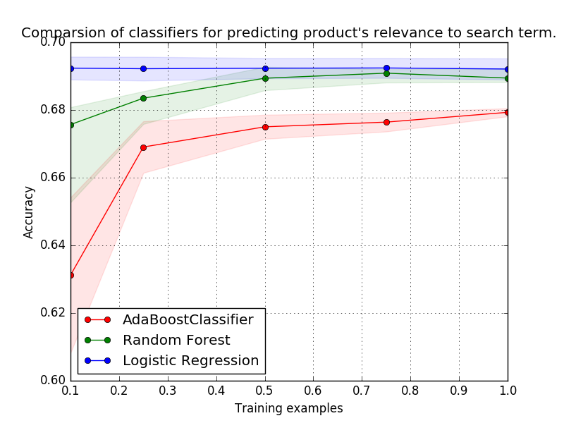

## Background
To enhance customer experience and engagement on online platforms it is imperative that the search results are highly relevant to the search terms. The objective of the project is to improve shopping experience of Home Depot customers by developing a model that can accurately predict the relevance of search results. The dataset is obtained from [Kaggle](https://www.kaggle.com/c/home-depot-product-search-relevance/data) and consists of description of every product available in Home Depot’s catalog, product attributes, search term/s and relevance score (a real number between 1.0 to 3.0) of the search terms to products.

## Plan of Work
The original problem as presented on Kaggle is a regression task where the objective is to predict a relevance score between a search term and the given product. We transformed this into a classification task with a relevance score of 2.0 as the threshold for a product to be relevant, given a search term. Our motivation for treating this as a binary classification method was to leverage more intuitive evaluation methods such as accuracy, confusion matrix, f-score over RMSE in a typical regression problem. Additionally, having had more exposre to classification in the course, we chose to convert this to a classification problem. The threshold was set at 2.0 as it was the mid point for the range of relevance scores. Our solution consists of three main parts: text data cleaning, feature engineering and model building and evaluation.

## Completed Work
Text preprocessing (data cleansing) involved removing stopwords, tokenizing, converting to lowercase, passing it through spell corrector and finally stemming it. Feature engineering involved developing basic descriptive features, distance features, word2vec embedding features intersect count and position features. Some of the features that we generated are:

+ Jaccard coefficient between search term and product title (and product description)
+ [Edit distance](https://en.wikipedia.org/wiki/Edit_distance) between search term and product title (and product description)
+ Intersect count features denoting number of word ngram in target (product title or description) closely matches with first (or last) ngram of search term
+ Co-occurrence count denoting count of closely matching word ngram pairs between target (product title or description) and search term
+ Average (cosine) similarity between search term and product title
+ RMSE between search term and product title
+ Longest string match between product description and search term
+ Asymmetric features that are non contextual such as presence of product dimensions (i.e width, height and weight)

The feature values were normalized so that we take into account varying length of search term and product title (and description). In addition to this, we consider two words to be matching if their relative **edit distance** is less than **0.2** in order to account for misspelt characters in a word, eg. conditionar (which probably should be conditioner).

The dataset consists of 74067 data points out of which 50428 are labelled as relevant and other 23639 are labelled as relevant. Currently we have 22 features capturing different relationships between search term and product metadata. The algorithms that we use for model building are Random Forests, AdaBoost and Logistic Regression. Model evaluation involved leveraging learning curve, 5-fold cross validation score and F1-scores to evaluate performance of our classifiers.

For model evaluation, we split dataset in 80:20 ratio (train-test split) maintaining the class proportions. The learning curve results are shown below (and in Figure 1). Refer to Appendix-1 for F1-scores.
```{r, echo=FALSE}
library(pander)
library(ggplot2)
x10<- c(0.325, 0.378, 0.308)
x25<- c(0.318, 0.332, 0.307)
x50<- c(0.314, 0.326, 0.308)
x75<- c(0.311, 0.323, 0.308)
x100<- c(0.308, 0.321, 0.307)
df_lc <- data.frame(x10, x25, x50, x75, x100)
colnames(df_lc) <- c('10%', '25%', '50%', '75%', '100%')
rownames(df_lc) <- c('RandomForest', 'Adaboost', 'Logistic Regression')
pander(df_lc)
```

Cross-validation results (Mean Accuracy over 5 folds):
```{r, echo=FALSE}
x1 <- c(0.687)
x2 <- c(0.625)
x3 <- c(0.693)
df_cv <- data.frame(x1, x2, x3)
colnames(df_cv) <- c('RandomForest', 'Adaboost', 'Logistic Regression')
rownames(df_cv) <- c('Accuracy')
pander(df_cv)
```


## Future Work

### Essential next steps: 
As the results obtained at the stage are far from being perfect, we plan to investigate, analyse and improve our results. We plan to re-iterate through all the stages (data cleaning, feature engineering, model building and evaluation) with the hope of improving the performance. Firstly, we plan to implement few more text cleaning approaches as suggested in Appendix-2. Secondly, add more features that could capture the relationship between search term and different aspects of product metadata *(using doc2vec features, wordNet features and Latent semantic analysis)*. Lastly, we plan to use Naive Bayes, SVM and Neural Network approaches to build the model and evaluate the performance.

### Optional:
If we get better results in early stages we plan to implement [*model stacking (ensemling)*](http://www.kdnuggets.com/2015/06/ensembles-kaggle-data-science-competition-p3.html) and evaluate the performance. Apart from predicting the relevance of search term we also plan to derive implicit relations between products given a search term. This will help find other similar products related to the search term which might not be apparent from the similarity measures of the product. For example, the relation between a ladder and a hammer might not be obvious from their product descriptions in spite of the fact that a person who buys a hammer probably would be needing a ladder to climb.


## References

  + Data Source:- https://www.kaggle.com/c/home-depot-product-search-relevance/data
  + Kaggle Forums. https://www.kaggle.com/c/home-depot-product-search-relevance/forums
  + Gensim python package for using word2Vec https://radimrehurek.com/gensim/models/word2vec.html
  + AdaBoost Classifier http://scikit-learn.org/stable/modules/generated/sklearn.ensemble.AdaBoostClassifier.html
  + RandomForest Classifier http://scikit-learn.org/stable/modules/generated/sklearn.ensemble.RandomForestClassifier.html
  + Learning Curve http://scikit-learn.org/stable/modules/generated/sklearn.learning_curve.learning_curve.html#sklearn.learning_curve
  + Word2Vec https://en.wikipedia.org/wiki/Word2vec

## Appendix

### 1. F1-scores

```{r, echo=FALSE}
x_c0<- c(0.422, 0.426, 0.294)
x_c1<- c(0.783, 0.772, 0.805)
df_f1 <- data.frame(x_c0, x_c1)
colnames(df_f1) <- c('Class0 (Irrelevant)', 'Class1 (Relevant)')
rownames(df_f1) <- c('RandomForest', 'Adaboost', 'Logistic Regression')
pander(df_f1)
```

### 2. Text cleaning methods

 + Replacing (or cleaning) symbols and patterns.
 + Removing words in parentheses or replace parentheses with dots/space.
 + Removing commas between digits (for example, 10, 000 will be replaced with 10000).
 + Replacing \ or / between letters with a space.

